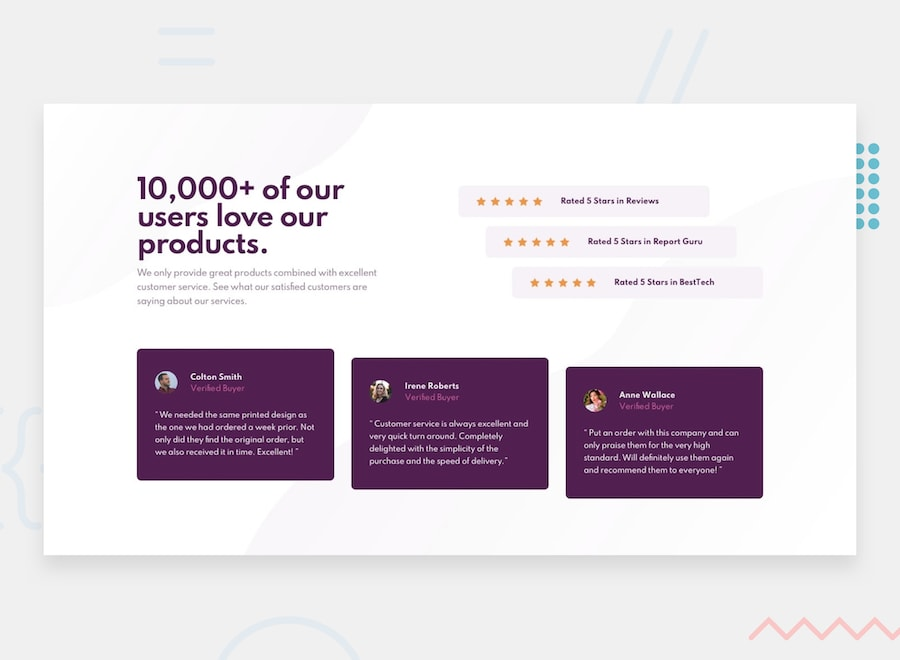

# Frontend Mentor - Social proof section

## The challenge
This is a challenge from [Frontend Mentor](https://www.frontendmentor.io/solutions)  
The challenge was to build out this social proof section and get it looking as close to the design as possible.

## Solution
The page is done using Sass with BEM naming.
You can see my working solution here: https://starskynder.github.io/social-proof-section/
